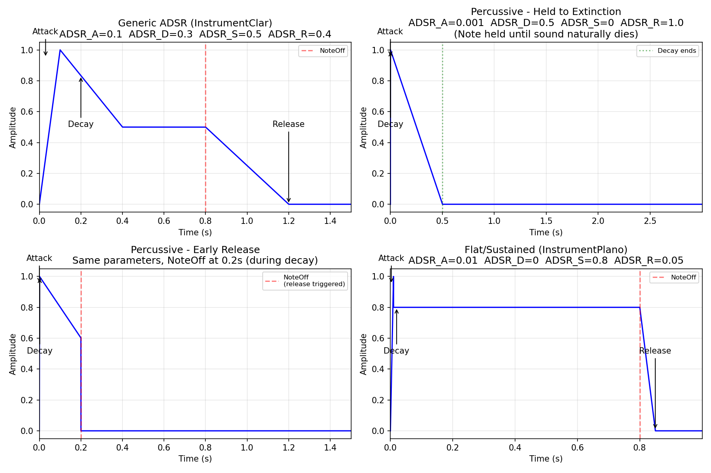
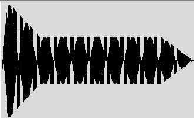
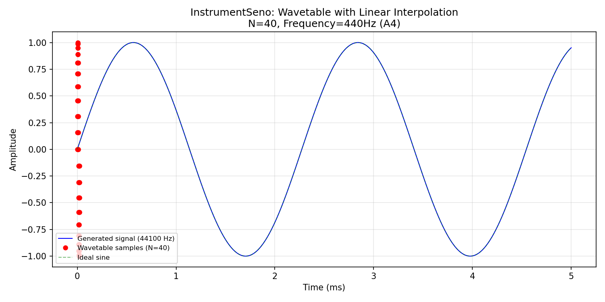

PAV - P5: síntesis musical polifónica
=====================================

Obtenga su copia del repositorio de la práctica accediendo a [Práctica 5](https://github.com/albino-pav/P5) 
y pulsando sobre el botón `Fork` situado en la esquina superior derecha. A continuación, siga las
instrucciones de la [Práctica 2](https://github.com/albino-pav/P2) para crear una rama con el apellido de
los integrantes del grupo de prácticas, dar de alta al resto de integrantes como colaboradores del proyecto
y crear la copias locales del repositorio.

Como entrega deberá realizar un *pull request* con el contenido de su copia del repositorio. Recuerde que
los ficheros entregados deberán estar en condiciones de ser ejecutados con sólo ejecutar:

~~~~~~~~~~~~~~~~~~~~~~~~~~~~~~~~~~~~~~~~~~~~~~~~~~~~~.sh
  make release
~~~~~~~~~~~~~~~~~~~~~~~~~~~~~~~~~~~~~~~~~~~~~~~~~~~~~

A modo de memoria de la práctica, complete, en este mismo documento y usando el formato *markdown*, los
ejercicios indicados.

Ejercicios.
-----------

### Envolvente ADSR.

Se han creado cuatro instrumentos que implementan la envolvente ADSR, todos ellos clonando
`InstrumentDumb` pero con distintos parámetros y nombres de clase. Cada instrumento hereda
de `Instrument` y utiliza `EnvelopeADSR` para la generación de la envolvente temporal.

| Instrumento | ADSR_A | ADSR_D | ADSR_S | ADSR_R | Descripción |
|-------------|--------|--------|--------|--------|-------------|
| `InstrumentDumb` | 0.002 | 0.1 | 0.0 | 0.05 | Percusivo simple |
| `InstrumentClar` | 0.1 | 0.3 | 0.5 | 0.4 | ADSR genérica — todas las fases visibles |
| `InstrumentPerc` | 0.001 | 0.5 | 0.0 | 1.0 | Percusivo — ataque muy rápido, sin mantenimiento |
| `InstrumentPlano` | 0.01 | 0.0 | 0.8 | 0.05 | Plano — ataque rápido, alto sostenido, liberación rápida |

Las curvas ADSR se generan mediante la clase `EnvelopeADSR`, que construye vectores de
amplitud para las fases de *attack* y *release*:

~~~~~~{.cpp}
// EnvelopeADSR::set()
n_attack  = (int)(0.5 + t_attack * SamplingRate);
n_decay   = (int)(0.5 + t_decay * SamplingRate);
n_pressed = n_attack + n_decay;
n_released = (int)(0.5 + t_release * SamplingRate);
// attack[0..n_attack-1]: rampa 0→1
// attack[n_attack..n_pressed-1]: rampa 1→S
// release[0..n_released-1]: rampa 1→0
~~~~~~

Los ficheros de configuración utilizados son:

- `work/clar.orc`: `1  InstrumentClar  ADSR_A=0.1; ADSR_D=0.3; ADSR_S=0.5; ADSR_R=0.4; N=40;`
- `work/perc.orc`: `1  InstrumentPerc  ADSR_A=0.001; ADSR_D=0.5; ADSR_S=0; ADSR_R=1.0; N=40;`
- `work/plano.orc`: `1  InstrumentPlano  ADSR_A=0.01; ADSR_D=0; ADSR_S=0.8; ADSR_R=0.05; N=40;`

**Interpretación de las gráficas:**

1. **ADSR Genérica (InstrumentClar):** Se aprecian claramente las cuatro fases. Tras el
   ataque de 0.1 s, la caída de 0.3 s hasta el mantenimiento en 0.5. El *NoteOff* (línea
   roja discontinua) se produce en t=0.8 s, iniciando la liberación de 0.4 s.

2. **Percusivo — mantenido hasta extinción (InstrumentPerc):** Ataque casi instantáneo
   (0.001 s), seguido de una caída de 0.5 s hasta S=0. El intérprete mantiene la nota
   pulsada durante toda la extinción: el *NoteOff* se produce cuando el sonido ya ha
   desaparecido.

3. **Percusivo — liberación anticipada (InstrumentPerc):** Mismos parámetros ADSR, pero el
   intérprete suelta la tecla en t=0.2 s (flecha roja), cuando aún hay sonido en la fase
   de caída. Se inicia entonces la liberación desde el nivel actual, produciendo una
   disminución más abrupta.

4. **Plano (InstrumentPlano):** Ataque rápido (0.01 s), sin caída (D=0), sostenido alto
   (S=0.8) y liberación rápida (0.05 s). Tras el *NoteOff* en t=0.8 s, la amplitud cae a
   cero casi instantáneamente.

**Generación de los ficheros de audio:**

~~~~~~{.sh}
synth clar.orc clar_adsr.sco work/clar_adsr.wav
synth perc.orc perc_held.sco work/perc_held.wav        # mantenido hasta extinción
synth perc.orc perc_release.sco work/perc_early.wav     # liberación anticipada
synth plano.orc plano_adsr.sco work/plano_adsr.wav
~~~~~~

### Instrumentos Dumb y Seno.

Se ha implementado el instrumento `InstrumentSeno` partiendo de `InstrumentDumb`. La principal
diferencia es que `InstrumentSeno` utiliza **interpolación lineal** para recorrer la tabla de
ondas, eliminando la distorsión armónica que produce el redondeo al entero más próximo
(*nearest-neighbor*) del `InstrumentDumb`.

**Método de acceso a la tabla:**

En lugar de redondear la fase al entero más cercano:

~~~~~~{.cpp}
// InstrumentDumb: nearest-neighbor
x[i] = A * tbl[(int) phase + 0.5];
~~~~~~

`InstrumentSeno` interpola linealmente entre las dos muestras adyacentes:

~~~~~~{.cpp}
// InstrumentSeno: interpolación lineal
unsigned int idx0 = (unsigned int) phase;
unsigned int idx1 = idx0 + 1;
if (idx1 >= tbl.size())
  idx1 = 0;
float frac = phase - idx0;
x[i] = A * (tbl[idx0] + frac * (tbl[idx1] - tbl[idx0]));
~~~~~~

De esta forma, cuando `phase` cae entre dos índices enteros (p. ej., phase=3.7), se toma el
70% de la muestra 4 y el 30% de la muestra 3, en lugar de redondear siempre a la muestra 4.
Esto elimina los escalones en la señal y produce un senoide limpio incluso con tablas
pequeñas (N=40).

**Cálculo de la frecuencia fundamental:**

La frecuencia de la nota se obtiene a partir del número de nota MIDI (`note`, siendo el La4=440 Hz
el valor 69):

    f0 = 440 × 2^{(note - 69) / 12}

La `step` de avance por la tabla es:

    step = f0 × tbl.size() / SamplingRate

**Generación de la tabla:**

Se almacena un ciclo completo de seno en `tbl[]` de tamaño N (configurable vía el parámetro del
`.orc`, por defecto N=40).

En la gráfica se muestran: los valores discretos de la tabla (puntos rojos), la señal
generada a 44100 Hz (línea azul continua), y la sinusoide ideal (línea verde discontinua).
Se aprecia cómo el muestreo a 44.1 kHz proporciona una reconstrucción prácticamente exacta
del seno deseado.

**Ficheros de configuración:**

- `work/seno.orc`: `1  InstrumentSeno  ADSR_A=0.02; ADSR_D=0.3; ADSR_S=0.6; ADSR_R=0.2; N=40;`

**Uso:**

~~~~~~{.sh}
synth seno.orc seno_doremi.sco work/seno_doremi.wav    # Escala de do
synth seno.orc doremi.sco work/seno_doremi2.wav         # Escala con InstrumentSeno
~~~~~~

### Efectos sonoros.

Se han implementado dos efectos: **trémolo** (modulación de amplitud) y **vibrato** (modulación de
frecuencia). Ambos heredan de la clase base `Effect` y se registran en la factoría
`effects/effect.cpp`.

**Trémolo:**

El trémolo modifica periódicamente la amplitud de la señal según la fórmula:

    x_r[n] = x_i[n] × (1 + A × cos(2π × F_m × n)) / (1 + A)

donde `F_m = f_m / f_s` es la frecuencia discreta de modulación, `A` la profundidad
(0 ≤ |A| < 1), y `f_s = 44100` Hz la frecuencia de muestreo.

Parámetros configurables desde el fichero `effects`:
- `A`: profundidad de la modulación (0.0 — 1.0; por defecto 0.5)
- `fm`: frecuencia de modulación en Hz (por defecto 10 Hz)

**Vibrato:**

El vibrato modifica periódicamente la afinación de la nota. Se implementa con un búfer
circular para garantizar la causalidad: la fase de modulación se define como

    fase_sen[n+1] = fase_sen[n] + 1 - I × sin(2π × f_m × t)

donde `I` es la profundidad en semitonos (convertida internamente a desplazamiento lineal:
`I_lin = 1 - 2^{-I/12}`) y `f_m` la frecuencia de modulación. Al usar una función
moduladora cuya integral es siempre negativa (el seno con signo negativo), se evita el
acceso a muestras futuras, manteniendo la causalidad del sistema.

Parámetros configurables desde el fichero `effects`:
- `I`: profundidad en semitonos (por defecto 1.0)
- `fm`: frecuencia de modulación en Hz (por defecto 10 Hz)

**Ficheros de prueba:**

- `work/effects.orc`: define un trémolo (efecto 1, A=0.10, fm=12 Hz)
- `work/doremi.sco` (modificado): escala diatónica con control de efectos

### Síntesis FM.

Construya un instrumento de síntesis FM, según las explicaciones contenidas en el enunciado y el artículo
de [John M. Chowning](https://web.eecs.umich.edu/~fessler/course/100/misc/chowning-73-tso.pdf). El
instrumento usará como parámetros **básicos** los números `N1` y `N2`, y el índice de modulación `I`, que
deberá venir expresado en semitonos.

- Use el instrumento para generar un vibrato de *parámetros razonables* e incluya una gráfica en la que se
  vea, claramente, la correspondencia entre los valores `N1`, `N2` e `I` con la señal obtenida.
- Use el instrumento para generar un sonido tipo clarinete y otro tipo campana. Tome los parámetros del
  sonido (N1, N2 e I) y de la envolvente ADSR del citado artículo. Con estos sonidos, genere sendas escalas
  diatónicas (fichero `doremi.sco`) y ponga el resultado en los ficheros `work/doremi/clarinete.wav` y
  `work/doremi/campana.work`.
  * También puede colgar en el directorio work/doremi otras escalas usando sonidos *interesantes*. Por
    ejemplo, violines, pianos, percusiones, espadas láser de la
	[Guerra de las Galaxias](https://www.starwars.com/), etc.

### Orquestación usando el programa synth.

Use el programa `synth` para generar canciones a partir de su partitura MIDI. Como mínimo, deberá incluir la
*orquestación* de la canción *You've got a friend in me* (fichero `ToyStory_A_Friend_in_me.sco`) del genial
[Randy Newman](https://open.spotify.com/artist/3HQyFCFFfJO3KKBlUfZsyW/about).

- En este triste arreglo, la pista 1 corresponde al instrumento solista (puede ser un piano, flauta,
  violín, etc.), y la 2 al bajo (bajo eléctrico, contrabajo, tuba, etc.).
- Coloque el resultado, junto con los ficheros necesarios para generarlo, en el directorio `work/music`.
- Indique, a continuación, la orden necesaria para generar la señal (suponiendo que todos los archivos
  necesarios están en el directorio indicado).

También puede orquestar otros temas más complejos, como la banda sonora de *Hawaii5-0* o el villacinco de
John Lennon *Happy Xmas (War Is Over)* (fichero `The_Christmas_Song_Lennon.sco`), o cualquier otra canción
de su agrado o composición. Se valorará la riqueza instrumental, su modelado y el resultado final.
- Coloque los ficheros generados, junto a sus ficheros `score`, `instruments` y `efffects`, en el directorio
  `work/music`.
- Indique, a continuación, la orden necesaria para generar cada una de las señales usando los distintos
  ficheros.

> NOTA:
>
> No olvide escuchar el resultado generado y comprobar que no se producen ruidos extraños o distorsiones.
> Sobre todo, tenga en cuenta la salud auditiva de quien será encargado de corregir su trabajo.
