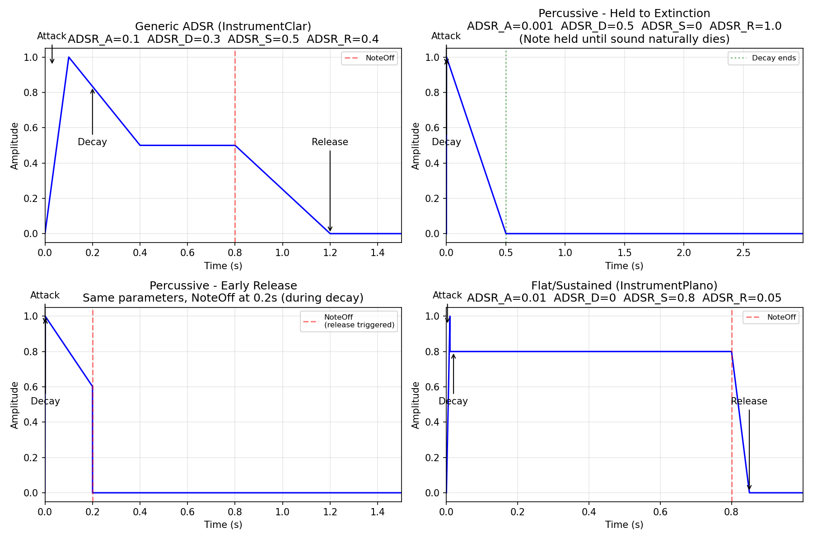
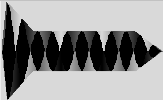
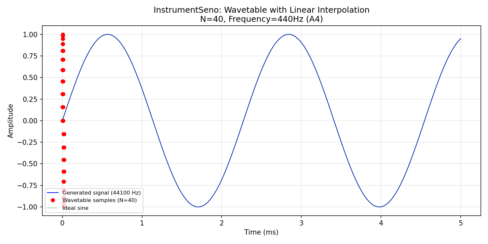
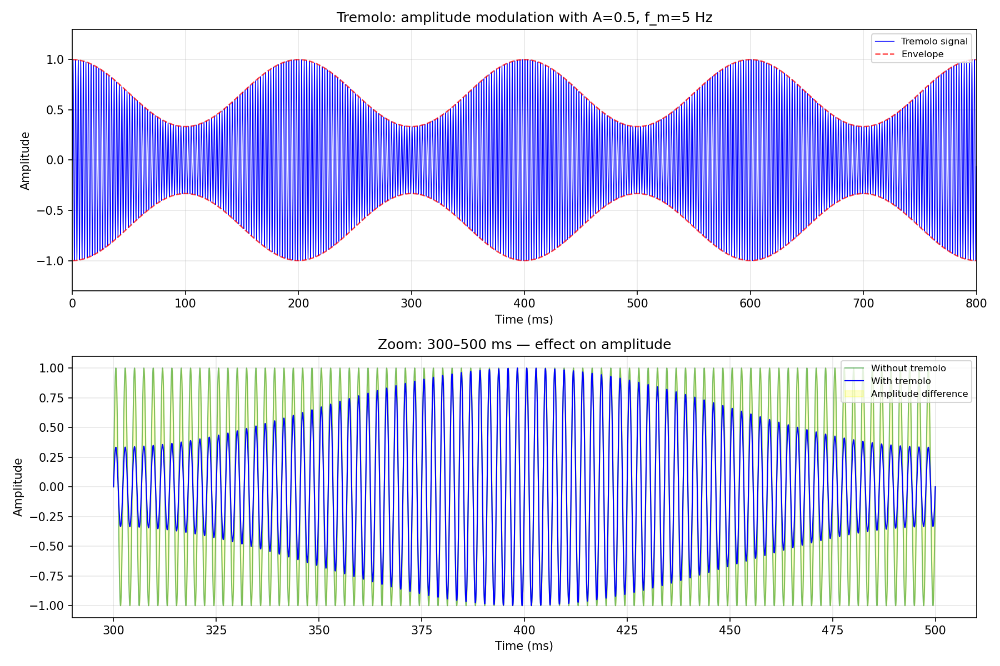
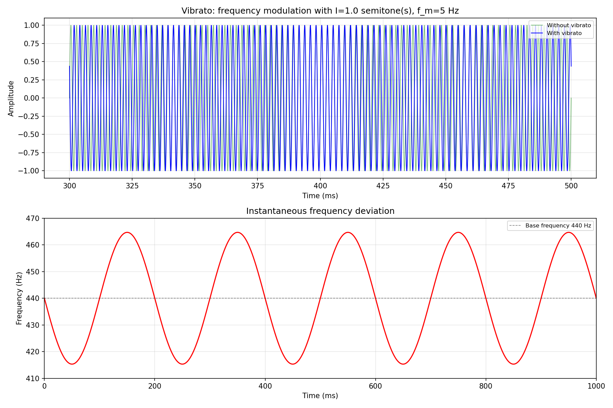
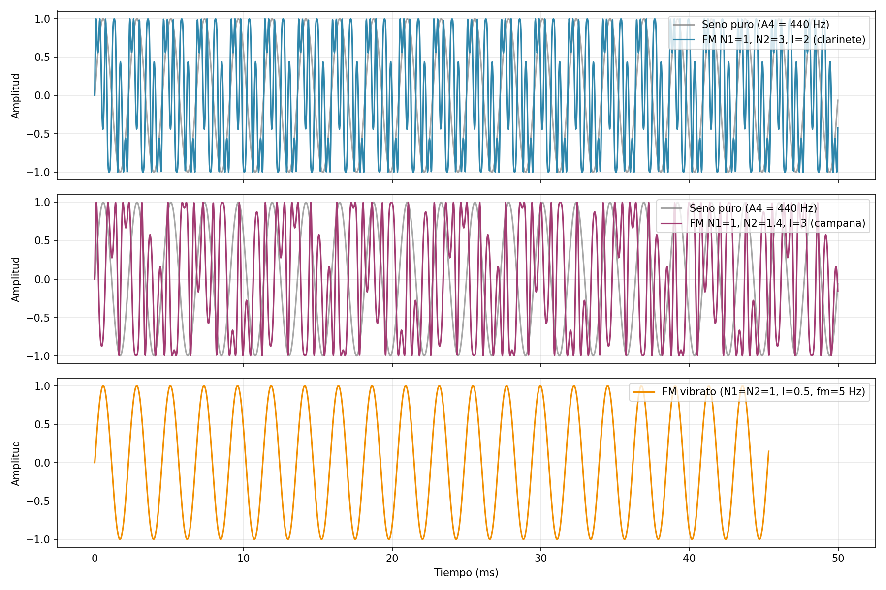
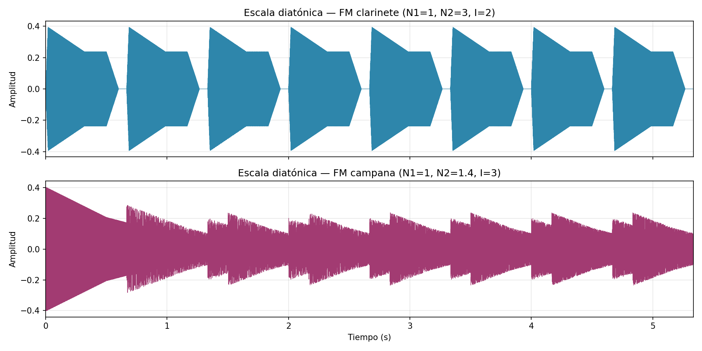

PAV - P5: síntesis musical polifónica
=====================================

Obtenga su copia del repositorio de la práctica accediendo a [Práctica 5](https://github.com/albino-pav/P5) 
y pulsando sobre el botón `Fork` situado en la esquina superior derecha. A continuación, siga las
instrucciones de la [Práctica 2](https://github.com/albino-pav/P2) para crear una rama con el apellido de
los integrantes del grupo de prácticas, dar de alta al resto de integrantes como colaboradores del proyecto
y crear la copias locales del repositorio.

Como entrega deberá realizar un *pull request* con el contenido de su copia del repositorio. Recuerde que
los ficheros entregados deberán estar en condiciones de ser ejecutados con sólo ejecutar:

~~~~~~~~~~~~~~~~~~~~~~~~~~~~~~~~~~~~~~~~~~~~~~~~~~~~~.sh
  make release
~~~~~~~~~~~~~~~~~~~~~~~~~~~~~~~~~~~~~~~~~~~~~~~~~~~~~

A modo de memoria de la práctica, complete, en este mismo documento y usando el formato *markdown*, los
ejercicios indicados.

Ejercicios
-----------

### Envolvente ADSR

Se han creado cuatro instrumentos que implementan la envolvente ADSR, todos ellos utilizando la base
`InstrumentSeno` pero con distintos parámetros. Cada instrumento hereda
de `Instrument` y utiliza `EnvelopeADSR` para la generación de la envolvente temporal, y utiliza interpolación lineal para calcular el valor de la muestra.

| Instrumento | ADSR_A | ADSR_D | ADSR_S | ADSR_R | Descripción |
|-------------|--------|--------|--------|--------|-------------|
| `InstrumentDumb` | 0.002 | 0.1 | 0.0 | 0.05 | Percusivo simple |
| `InstrumentClar` | 0.1 | 0.3 | 0.5 | 0.4 | ADSR genérica — todas las fases visibles |
| `InstrumentPerc` | 0.001 | 0.5 | 0.0 | 1.0 | Percusivo — ataque muy rápido, sin mantenimiento |
| `InstrumentPlano` | 0.01 | 0.0 | 0.8 | 0.05 | Plano — ataque rápido, alto sostenido, liberación rápida |

Las curvas ADSR se generan mediante la clase `EnvelopeADSR`, que construye vectores de
amplitud para las fases de *attack* y *release*:

~~~~~~{.cpp}
// EnvelopeADSR::set()
n_attack  = (int)(0.5 + t_attack * SamplingRate);
n_decay   = (int)(0.5 + t_decay * SamplingRate);
n_pressed = n_attack + n_decay;
n_released = (int)(0.5 + t_release * SamplingRate);
// attack[0..n_attack-1]: rampa 0→1
// attack[n_attack..n_pressed-1]: rampa 1→S
// release[0..n_released-1]: rampa 1→0
~~~~~~

Los ficheros de configuración utilizados son:

- `work/clar.orc`: `1  InstrumentSeno  ADSR_A=0.1; ADSR_D=0.3; ADSR_S=0.5; ADSR_R=0.4; N=40;`
- `work/perc.orc`: `1  InstrumentSeno  ADSR_A=0.001; ADSR_D=0.5; ADSR_S=0; ADSR_R=1.0; N=40;`
- `work/plano.orc`: `1  InstrumentSeno  ADSR_A=0.01; ADSR_D=0; ADSR_S=0.8; ADSR_R=0.05; N=40;`

**Curvas ADSR de los cuatro instrumentos**


**ADSR Genérica**


**ADSR Percusión pulsada**


**ADSR Percusión finalizada**


**ADSR Flauta**


**Interpretación de las gráficas:**

1. **ADSR Genérica (InstrumentClar):** Se aprecian claramente las cuatro fases. Tras el
   ataque de 0.1 s, la caída de 0.3 s hasta el mantenimiento en 0.5. El *NoteOff* (línea
   roja discontinua) se produce en t=0.8 s, iniciando la liberación de 0.4 s.

2. **Percusivo — mantenido hasta extinción (InstrumentPerc):** Ataque casi instantáneo
   (0.001 s), seguido de una caída de 0.5 s hasta S=0. El intérprete mantiene la nota
   pulsada durante toda la extinción: el *NoteOff* se produce cuando el sonido ya ha
   desaparecido.

3. **Percusivo — liberación anticipada (InstrumentPerc):** Mismos parámetros ADSR, pero el
   intérprete suelta la tecla en t=0.2 s (flecha roja), cuando aún hay sonido en la fase
   de caída. Se inicia entonces la liberación desde el nivel actual, produciendo una
   disminución más abrupta.

4. **Plano (InstrumentPlano):** Ataque rápido (0.01 s), sin caída (D=0), sostenido alto
   (S=0.8) y liberación rápida (0.05 s). Tras el *NoteOff* en t=0.8 s, la amplitud cae a
   cero casi instantáneamente.

**Generación de los ficheros de audio:**

~~~~~~{.sh}
synth clar.orc clar_adsr.sco work/clar_adsr.wav
synth perc.orc perc_held.sco work/perc_held.wav        # mantenido hasta extinción
synth perc.orc perc_release.sco work/perc_early.wav     # liberación anticipada
synth plano.orc plano_adsr.sco work/plano_adsr.wav
~~~~~~

### Instrumentos Dumb y Seno.

Se ha implementado el instrumento `InstrumentSeno` partiendo de `InstrumentDumb`. La principal
diferencia es que `InstrumentSeno` utiliza **interpolación lineal** para recorrer la tabla de
ondas, eliminando la distorsión armónica que produce el redondeo al entero más próximo
(*nearest-neighbor*) del `InstrumentDumb`.

**Método de acceso a la tabla:**

En lugar de redondear la fase al entero más cercano:

~~~~~~{.cpp}
// InstrumentDumb: nearest-neighbor
x[i] = A * tbl[(int) phase + 0.5];
~~~~~~

`InstrumentSeno` interpola linealmente entre las dos muestras adyacentes:

~~~~~~{.cpp}
// InstrumentSeno: interpolación lineal
unsigned int idx0 = (unsigned int) phase;
unsigned int idx1 = idx0 + 1;
if (idx1 >= tbl.size())
  idx1 = 0;
float frac = phase - idx0;
x[i] = A * (tbl[idx0] + frac * (tbl[idx1] - tbl[idx0]));
~~~~~~

De esta forma, cuando `phase` cae entre dos índices enteros (p. ej., phase=3.7), se toma el
70% de la muestra 4 y el 30% de la muestra 3, en lugar de redondear siempre a la muestra 4.
Esto elimina los escalones en la señal y produce un senoide limpio incluso con tablas
pequeñas (N=40).

**Cálculo de la frecuencia fundamental:**

La frecuencia de la nota se obtiene a partir del número de nota MIDI (`note`, siendo el La4=440 Hz
el valor 69):

    f0 = 440 × 2^{(note - 69) / 12}

La `step` de avance por la tabla es:

    step = f0 × tbl.size() / SamplingRate

**Generación de la tabla:**

Se almacena un ciclo completo de seno en `tbl[]` de tamaño N (configurable vía el parámetro del
`.orc`, por defecto N=40).



En la gráfica se muestran: los valores discretos de la tabla (puntos rojos), la señal
generada a 44100 Hz (línea azul continua), y la sinusoide ideal (línea verde discontinua).
Se aprecia cómo el muestreo a 44.1 kHz proporciona una reconstrucción prácticamente exacta
del seno deseado.

**Ficheros de configuración:**

- `work/seno.orc`: `1  InstrumentSeno  ADSR_A=0.02; ADSR_D=0.3; ADSR_S=0.6; ADSR_R=0.2; N=40;`

**Uso:**

~~~~~~{.sh}
synth seno.orc seno_doremi.sco work/seno_doremi.wav    # Escala de do
synth seno.orc doremi.sco work/seno_doremi2.wav         # Escala con InstrumentSeno
~~~~~~

### Efectos sonoros

Se han implementado dos efectos: **trémolo** (modulación de amplitud) y **vibrato** (modulación de
frecuencia). Ambos heredan de la clase base `Effect` y se registran en la factoría
`effects/effect.cpp`.

**Trémolo:**

El trémolo modifica periódicamente la amplitud de la señal según la fórmula:

    x_r[n] = x_i[n] × (1 + A × cos(2π × F_m × n)) / (1 + A)

donde `F_m = f_m / f_s` es la frecuencia discreta de modulación, `A` la profundidad
(0 ≤ |A| < 1), y `f_s = 44100` Hz la frecuencia de muestreo.

Parámetros configurables desde el fichero `effects`:
- `A`: profundidad de la modulación (0.0 — 1.0; por defecto 0.5)
- `fm`: frecuencia de modulación en Hz (por defecto 10 Hz)

**Vibrato:**

El vibrato modifica periódicamente la afinación de la nota. Se implementa con un búfer
circular para garantizar la causalidad: la fase de modulación se define como

    fase_sen[n+1] = fase_sen[n] + 1 - I × sin(2π × f_m × t)

donde `I` es la profundidad en semitonos (convertida internamente a desplazamiento lineal:
`I_lin = 1 - 2^{-I/12}`) y `f_m` la frecuencia de modulación. Al usar una función
moduladora cuya integral es siempre negativa (el seno con signo negativo), se evita el
acceso a muestras futuras, manteniendo la causalidad del sistema.

Parámetros configurables desde el fichero `effects`:
- `I`: profundidad en semitonos (por defecto 1.0)
- `fm`: frecuencia de modulación en Hz (por defecto 10 Hz)

**Ficheros de prueba:**

- `work/effects_tremolo.orc`: define trémolo (efecto 1, A=0.5, fm=5 Hz)
- `work/effects_vibrato.orc`: define vibrato (efecto 1, I=1 semitono, fm=5 Hz)
- `work/tremolo_test.sco`: nota A4 sostenida ~3 s; trémolo activo entre t≈1 s y t≈2 s
- `work/vibrato_test.sco`: nota A4 sostenida ~3 s; vibrato activo entre t≈1 s y t≈2 s
- `work/tremolo_doremi.sco`: escala diatónica C4–C5 con trémolo permanente
- `work/vibrato_doremi.sco`: escala diatónica C4–C5 con vibrato permanente

**Gráficas:**



La gráfica superior muestra la señal portadora (440 Hz, A4) modulada en amplitud
por un trémolo con A=0.5 y fm=5 Hz. La envolvente (línea roja discontinua)
sigue la variación periódica `(1 + A·cos(2π·fm·t))/(1 + A)` que escala la
amplitud instantánea. En la gráfica inferior se superpone la señal sin trémolo
para apreciar el efecto sobre la amplitud.



La gráfica superior compara la señal con y sin vibrato (I=1 semitono, fm=5 Hz).
El desplazamiento de fase relativo evidencia la fluctuación periódica de la
frecuencia instantánea. La gráfica inferior muestra la frecuencia instantánea
oscilando alrededor de la frecuencia base (440 Hz) con una desviación de
aproximadamente ±20 Hz.

**Generación de las señales de prueba:**

~~~~~~~~~~~~~~~~~~~~~~~~~~~~~~~~~~~~~~~~~~~~~~~~~~~~~.sh
# Nota sostenida con trémolo (activo en la parte central)
synth -e work/effects_tremolo.orc work/seno.orc work/tremolo_test.sco work/tremolo_test.wav

# Nota sostenida con vibrato (activo en la parte central)
synth -e work/effects_vibrato.orc work/seno.orc work/vibrato_test.sco work/vibrato_test.wav

# Escala diatónica con trémolo
synth -e work/effects_tremolo.orc work/seno.orc work/tremolo_doremi.sco work/tremolo_doremi.wav

# Escala diatónica con vibrato
synth -e work/effects_vibrato.orc work/seno.orc work/vibrato_doremi.sco work/vibrato_doremi.wav

# Regenerar las gráficas
python3 work/gen_effects_plot.py
~~~~~~~~~~~~~~~~~~~~~~~~~~~~~~~~~~~~~~~~~~~~~~~~~~~~~

**Estructura de control de efectos desde el score (.sco):**

Los efectos se activan y desactivan mediante el evento 12:

    ticks  12  channel  effect_number  command

- `command = 0`: elimina el efecto del canal
- `command ≠ 0`: asigna el efecto al canal y ejecuta `effect->command(command)`

Por ejemplo, en `tremolo_test.sco`:
```
0    9    1    69    100     # NoteOn A4
240  12   1    1     1       # Activar trémolo (t≈1 s)
240  12   1    1     0       # Desactivar trémolo (t≈2 s)
240  8    1    69    100     # NoteOff
```

### Síntesis por tabla externa y por sampler

Se han implementado los instrumentos `InstrumentExt` e `InstrumentSamp` partiendo de `InstrumentSeno`. `InstrumentExt` utiliza una tabla externa de valores para su tabla de ondas, y mantiene el resto del proceso de síntesis igual a `InstrumentSeno`. La tabla exterior usada modela un periodo de un seno de frecuencia 1 Hz y amplitud 1, a partir del cual se puede fácilmente sintetizar cualquier nota con los cálculos empleados previamente en `InstrumentSeno`.

Para obtener la información del fichero dado:

~~~~~~{.cpp}
KeyValue kv(param);
static string kv_null;
std::string file_name = "Ext_table.wav"; //Default value
std::string tmp = kv("File");
if (tmp != kv_null) {
  file_name = tmp;
  file_name.erase(remove(file_name.begin(), file_name.end(), '"'), file_name.end());
}

unsigned int fm;
if (readwav_mono(file_name,fm,tbl) < 0) {
  cerr << "Error: no se puede leer el fichero " << file_name << " para un instrumento FicTabla" << endl;
  throw -1;
}
~~~~~~


En la gráfica se muestra: el resultado de sintetizar el score "doremi.sco" con `InstrumentExt`.

`InstrumentSamp` es similar a `InstrumentExt` en que también utiliza ficheros externos. Otorgándole una muestra de un instrumento tocando una nota completa este crea su propia tabla de ondas y la utiliza para sintetizar cualquier otra nota. Adicionalmente, se le puede indicar si la muestra es melódica o no (por ejemplo, instrumentos de percusión tienden a ser mucho menos melódicos que el resto), según lo cual se cambiará como se procesan las notas indicadas por el fichero Midi.

Según la musicalidad del sample:

~~~~~~{.cpp}
kv.to_int("Melodic", melodic);
...
if(melodic == 0){
  this->step = 1;
} else{
  // Piano sample used plays C4 (261 Hz)
  this->step = (440/261)*pow(2, (note-69)/12.)*tbl.size()/SamplingRate;
}
~~~~~~


En la gráfica se muestra: el resultado de sintetizar el score "doremi.sco" con `InstrumentSamp`.

**Ficheros de configuración:**

- `work/ext.orc`: `1	InstrumentExt	ADSR_A=0.1; ADSR_D=0.1; ADSR_S=0.5; ADSR_R=0.2; File = "Ext_table.wav";`
- `work/samp.orc`: `1	InstrumentSamp	ADSR_A=0.1; ADSR_D=0; ADSR_S=1.25; ADSR_R=0.1; File = "piano-trident.wav"; Melodic = 1;`

**Uso:**

~~~~~~{.sh}
synth ext.orc doremi.sco work/doremi_ext.wav
synth samp.orc doremi.sco work/seno_samp.wav
~~~~~~

### Síntesis FM

Se han implementado dos instrumentos de síntesis FM:

- **`InstrumentFM`**: modulación FM simple con parámetros `I` (índice de modulación) y `fm`
  (frecuencia moduladora en Hz). La señal se genera como:

  ```
  x[n] = A · sen(2π·fc·n + I · sen(2π·fm·n))
  ```

  donde `fc` es la frecuencia fundamental de la nota y `fm` la frecuencia del modulador.

- **`InstrumentFMN1N2`**: modulación FM con relación de frecuencias `N1:N2` (carrier:modulator).
  Se genera según la ecuación:

  ```
  x[n] = A · sen(N1·θc[n] + I · sen(N2·θm[n]))
  ```

  donde `θc = 2π·f0·t` es la fase de la portadora y `θm = 2π·f0·t` la del modulador,
  escaladas por `N1` y `N2` respectivamente. El índice de modulación `I` determina la
  cantidad de modulación (expresado en semitonos).

La implementación utiliza dos osciladores digitales con fase acumulativa y `wrap-around`
a `±π` para evitar overflow:

~~~~~~{.cpp}
x[i] = A * sin(phase1 + I * sin(phase2));
phase1 += step1;   // step1 = 2·π·N1·f0/fs
phase2 += step2;   // step2 = 2·π·N2·f0/fs
while (phase1 >= M_PI) phase1 -= 2*M_PI;
while (phase2 >= M_PI) phase2 -= 2*M_PI;
~~~~~~

**Vibrato FM:**

Usando `N1=N2=1` con un índice pequeño (I=0.5) y frecuencia moduladora sub-audio (fm=5 Hz),
se obtiene un efecto de vibrato: la frecuencia instantánea oscila alrededor de la frecuencia
base con una desviación proporcional a `I·fm`. La gráfica siguiente muestra el resultado para
la nota A4 (440 Hz):



**Sonidos de clarinete y campana (Chowning):**

Siguiendo el artículo de Chowning, se usan las siguientes configuraciones:

| Sonido | N1:N2 | I  | ADSR_A | ADSR_D | ADSR_S | ADSR_R | Descripción |
|--------|-------|----|--------|--------|--------|--------|-------------|
| Clarinete | 1:3 | 2 | 0.02 | 0.3 | 0.6 | 0.1 | Relación 1:3 con índice moderado |
| Campana | 1:1.4 | 3 | 0.001 | 1.0 | 0.0 | 1.0 | Relación 1:1.4, campana con extinción lenta |

- **Clarinete** (`work/doremi/clarinete.orc`): N1=1, N2=3, I=2, con ADSR de ataque suave y
  mantenimiento sostenido. El sonido resultante tiene un timbre similar al clarinete real
  gracias a la riqueza armónica que aporta la relación 1:3.
- **Campana** (`work/doremi/campana.orc`): N1=1, N2=1.4 (~7/5), I=3, con ADSR de ataque
  instantáneo y caída lenta sin sostenimiento. La relación no entera 1:1.4 produce
  parciales no armónicos que imitan el sonido de campana.



**Generación de los ficheros de audio:**

~~~~~~{.sh}
# Escala diatónica con sonido de clarinete
synth work/doremi/clarinete.orc work/doremi/doremi.sco work/doremi/clarinete.wav

# Escala diatónica con sonido de campana
synth work/doremi/campana.orc work/doremi/doremi.sco work/doremi/campana.wav

# FM vibrato (N1=N2=1, I=0.5, fm=5 Hz)
synth work/doremi/vibrato_fm.orc work/doremi/vibrato_test.sco work/doremi/vibrato_fm.wav
~~~~~~

Se ha implementado el instrumento `InstrumentFM_N1N2` partiendo de `InstrumentSeno`. Este utiliza síntesis FM para modelar la tabla de ondas y el recorrido de esta, permitiendo la síntesis de instrumentos con más profundidad (a diferencia de frecuencias puras) según la metodología descrita por John M. Chowing.

**Parámetros utilizados:**

La frecuencia de la nota se obtiene a partir del número de nota MIDI (`note`, siendo el La4=440 Hz
el valor 69):

    f0 = 440 × 2^{(note - 69) / 12} / SamplingRate

A diferencia de `InstrumentSeno`, `InstrumentFM_N1N2` tiene dos `steps` diferentes, `step1` correspondiente a la carrier frequency, y `step2` correspondiente a la modulation frequency, calculados como:

    step1 = 2 × M_PI × f0 × N1; //carrier frequency step in rad/s
    step2 = 2 × M_PI × f0 × N2; //modulation frequency step in rad/s


**Ficheros de configuración:**

- `work/fm_n1n2.orc`: `1  InstrumentFM_N1N2	ADSR_A=0.02; ADSR_D=0.1; ADSR_S=0.4; ADSR_R=0.1; I=1; N1=2; N2=3; Amp=1;`
- `work/clarinete.orc`: `1  InstrumentFM_N1N2  ADSR_A=0.1; ADSR_D=0; ADSR_S=0.8; ADSR_R=0.05; I=4; N1=3; N2=2; Amp=1;`
- `work/campana.orc`: `1  InstrumentFM_N1N2  ADSR_A=0.01; ADSR_D=0.5; ADSR_S=0; ADSR_R=0; I=0; N1=5; N2=7; Amp=1;`

**Uso:**

~~~~~~{.sh}
synth fm_n1n2.orc doremi.sco work/doremi_fmN1N2.wav
synth clarinete.orc doremi.sco work/doremi_clarinete.wav
synth campana.orc doremi.sco work/doremi_campana.wav
~~~~~~

### Orquestación usando el programa synth

Se han orquestado dos canciones usando el programa `synth` con instrumentos de síntesis FM,
ubicando los ficheros en `work/music/`.

#### Toy Story — You've Got a Friend in Me

El arreglo dispone de dos pistas:
- **Pista 1** (solista, notas MIDI 55–79): `InstrumentFMN1N2` con parámetros de piano FM
  (N1=1, N2=2, I=0.5, ADSR rápido). La relación 1:2 proporciona un timbre brillante
  adecuado para la melodía principal.
- **Pista 2** (bajo, notas MIDI 34–65): `InstrumentFMN1N2` con parámetros de bajo FM
  (N1=1, N2=1, I=1, ADSR sostenido). La relación 1:1 con índice bajo produce un sonido
  grave y estable para el acompañamiento.

Fichero de instrumentos (`work/music/toystory.orc`):
```
1	InstrumentFMN1N2	ADSR_A=0.01; ADSR_D=0.1; ADSR_S=0.7; ADSR_R=0.1; I=0.5; N1=1; N2=2;
2	InstrumentFMN1N2	ADSR_A=0.05; ADSR_D=0.2; ADSR_S=0.8; ADSR_R=0.2; I=1; N1=1; N2=1;
```

Generación:
~~~~~~{.sh}
synth work/music/toystory.orc samples/ToyStory_A_Friend_in_me.sco work/music/toystory.wav
~~~~~~

También se ofrece una versión alternativa con piano (`InstrumentPlano`) para la melodía:
~~~~~~{.sh}
synth work/music/toystory_alt.orc samples/ToyStory_A_Friend_in_me.sco work/music/toystory_alt.wav
~~~~~~

#### Hawaii Five-O

La partitura MIDI de *Hawaii Five-O* se ha convertido a formato `.sco` usando la utilidad
`midi2sco.py` con tempo original (bpm=163, tpb=120). La orquestación consta de 16 canales:

| Canal | Instrumento | Parámetros FM |
|-------|-------------|---------------|
| 1–7 | Percusión (`InstrumentPerc`) | ADSR percusivo según el tipo |
| 8 | Bajo | N1=1, N2=1, I=5 |
| 9 | Guitarra | N1=1, N2=2, I=1 |
| 10 | Brass | N1=1, N2=3, I=1.5 |
| 11 | Hard brass | N1=1, N2=3, I=2 |
| 12–13 | Flautas | N1=1, N2=4, I=0.3 |
| 14–15 | Trombones | N1=1, N2=2, I=2 |
| 16 | Hard brass 2 | N1=1, N2=3, I=2 |

Fichero de instrumentos (`work/music/hawaii50.orc`):
~~~~~~
1	InstrumentPerc	ADSR_A=0.001; ADSR_D=0.3; ADSR_S=0; ADSR_R=0.1;
...
16	InstrumentFMN1N2	ADSR_A=0.02; ADSR_D=0.2; ADSR_S=0.7; ADSR_R=0.1; I=2; N1=1; N2=3;
~~~~~~

Generación:
~~~~~~{.sh}
synth -b 163 -t 120 work/music/hawaii50.orc work/music/hawaii50.sco work/music/hawaii50.wav
~~~~~~

Hemos generado tanto la sintetización de la canción *You've got a friend in me* como de la canción *Uptown Girl* de [Billy Joel]. Para una mejor experiencia de escucha se ha añadido al instrumento `InstrumentFM_N1N2` la opción de establecer la amplitud máxima de la señal con la opción `Amp`, tal que:

~~~~~~{.cpp}
kv.to_float("Amp",amp);
...
x[i] = amp * A * sin(phase1 + I_lin*sin(phase2));
~~~~~~

Para generarlos son necesarias las siguientes órdenes:

~~~~~~{.sh}
synth ToyStory_A_Friend_in_me.orc ToyStory_A_Friend_in_me.sco ToyStory_A_Friend_in_me.wav
synth Uptown_Girl.orc Uptown_Girl.sco Uptown_Girl.wav
~~~~~~


> NOTA:
>
> No olvide escuchar el resultado generado y comprobar que no se producen ruidos extraños o distorsiones.
> Sobre todo, tenga en cuenta la salud auditiva de quien será encargado de corregir su trabajo.
